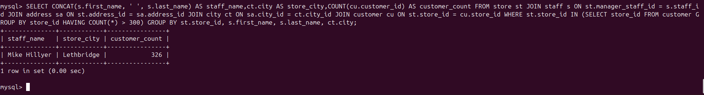
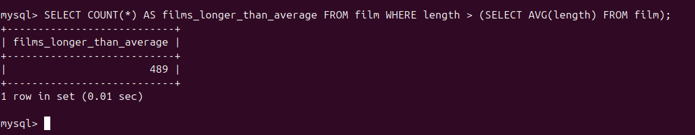
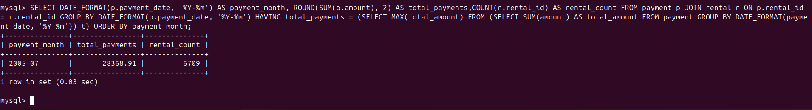
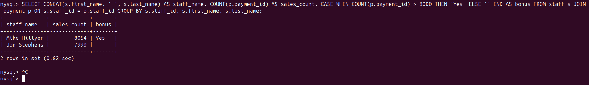
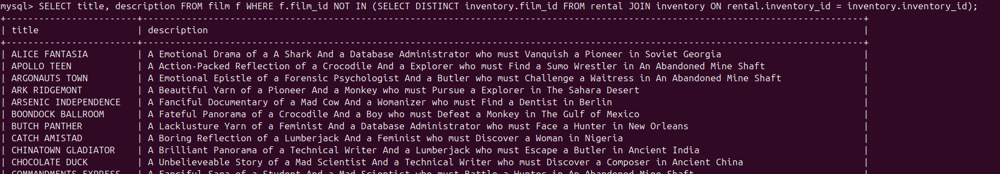
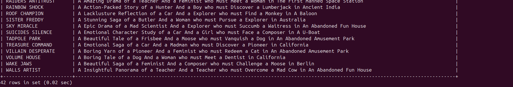

# Домашнее задание к занятию "SQL. Часть 2" - Кучин Виталий

### Инструкция по выполнению домашнего задания

   1. Сделайте `fork` данного репозитория к себе в Github и переименуйте его по названию или номеру занятия, например, https://github.com/имя-вашего-репозитория/git-hw или  https://github.com/имя-вашего-репозитория/7-1-ansible-hw).
   2. Выполните клонирование данного репозитория к себе на ПК с помощью команды `git clone`.
   3. Выполните домашнее задание и заполните у себя локально этот файл README.md:
      - впишите вверху название занятия и вашу фамилию и имя
      - в каждом задании добавьте решение в требуемом виде (текст/код/скриншоты/ссылка)
      - для корректного добавления скриншотов воспользуйтесь [инструкцией "Как вставить скриншот в шаблон с решением](https://github.com/netology-code/sys-pattern-homework/blob/main/screen-instruction.md)
      - при оформлении используйте возможности языка разметки md (коротко об этом можно посмотреть в [инструкции  по MarkDown](https://github.com/netology-code/sys-pattern-homework/blob/main/md-instruction.md))
   4. После завершения работы над домашним заданием сделайте коммит (`git commit -m "comment"`) и отправьте его на Github (`git push origin`);
   5. Для проверки домашнего задания преподавателем в личном кабинете прикрепите и отправьте ссылку на решение в виде md-файла в вашем Github.
   6. Любые вопросы по выполнению заданий спрашивайте в чате учебной группы и/или в разделе “Вопросы по заданию” в личном кабинете.
   
Желаем успехов в выполнении домашнего задания!
   
### Дополнительные материалы, которые могут быть полезны для выполнения задания

1. [Руководство по оформлению Markdown файлов](https://gist.github.com/Jekins/2bf2d0638163f1294637#Code)

---

### Задание 1
1) SELECT CONCAT(s.first_name, ' ', s.last_name) AS staff_name,ct.city AS store_city,COUNT(cu.customer_id) AS customer_count FROM store st JOIN staff s ON st.manager_staff_id = s.staff_id JOIN address sa ON st.address_id = sa.address_id JOIN city ct ON sa.city_id = ct.city_id JOIN customer cu ON st.store_id = cu.store_id WHERE st.store_id IN (SELECT store_id FROM customer GROUP BY store_id HAVING COUNT(*) > 300) GROUP BY st.store_id, s.first_name, s.last_name, ct.city;

Скриншоты.  
  

### Задание 2

1) SELECT COUNT(*) AS films_longer_than_average FROM film WHERE length > (SELECT AVG(length) FROM film);   

  

### Задание 3

1) SELECT DATE_FORMAT(p.payment_date,'%Y-%m') AS payment_month, ROUND(SUM(p.amount), 2) AS total_payments,COUNT(r.rental_id) AS rental_count FROM payment p JOIN rental r ON p.rental_id = r.rental_id GROUP BY DATE_FORMAT(p.payment_date, '%Y-%m') HAVING total_payments = (SELECT MAX(total_amount) FROM (SELECT SUM(amount) AS total_amount FROM payment GROUP BY DATE_FORMAT(payment_date, '%Y-%m')) t) ORDER BY payment_month;

  

### Задание 4

1) SELECT CONCAT(s.first_name, ' ', s.last_name) AS staff_name, COUNT(p.payment_id) AS sales_count, CASE WHEN COUNT(p.payment_id) > 8000 THEN 'Yes' ELSE 'Нет' END AS bonus FROM staff s JOIN payment p ON s.staff_id = p.staff_id GROUP BY s.staff_id, s.first_name, s.last_name;
 

  

### Задание 5*

1) SELECT title, description FROM film f WHERE f.film_id NOT IN (SELECT DISTINCT inventory.film_id FROM rental JOIN inventory ON rental.inventory_id = inventory.inventory_id);

  
  

